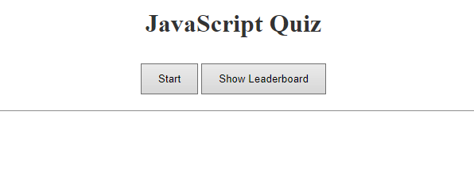

# JavaScript Quiz (Module-04-Challenge)

This repository contains the HTML and JavaScript for a simple timed quiz.

## Table of Contents

- [Introduction](#introduction)
- [Quiz Instructions](#quiz-instructions)
- [Usage](#usage)
- [Credits](#credits)
- [License](#license)

## Introduction

The HTML and JavaScript code in this repository is an app for a simple JavaScript themed mulitple choice quiz that is timed.

## Quiz Instructions

You have 1 minute to answer all four JavaScript question! Answer wrong and 5 seconds will be removed from your time! Save you initials and score at the end to the leaderboard!

## Usage

See commented lines in the HTML and CSS files to see how the app works. Website is hosted [here.](https://nephh.github.io/javascript-quiz)

### Website Screenshot

## Credits

N/A

## License

Please refer to the license in the repo
